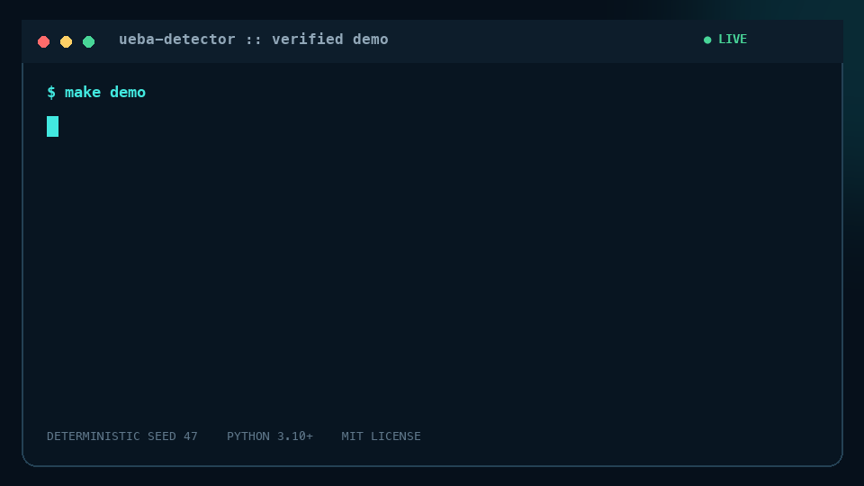
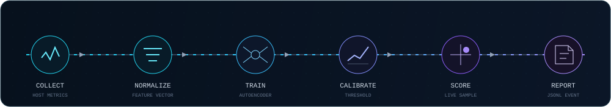

# ML Host Anomaly Detection

[](https://github.com/Kxrma47/ml-host-anomaly-detection/actions/workflows/tests.yml)

[](LICENSE)


I started this project with a practical question: can a small model learn what
normal activity looks like on one computer and point out the moments that deserve
a closer look?

The result is a working host-monitoring pipeline. It collects resource metrics
and security events, turns them into minute-by-minute behavior windows, trains a
compact neural autoencoder on normal activity, and combines the model score with
plain security rules. It can run on a laptop, does not need a cloud service, and
keeps the collected data local.

This is still a research prototype. It is useful for experimentation, portfolio
work, and learning how a UEBA pipeline fits together. It is not a replacement
for a production EDR or SIEM, and it does not promise perfect attack detection.

<p align="center">
  
</p>

## What the program actually watches

Once a minute, the metric collector records CPU, memory, swap, load, process and
thread counts, network rates, TCP state counts, remote-port diversity, and disk
read/write rates. These are broad signals rather than detailed surveillance. A
network scan, a process burst, or unusually heavy file activity changes several
of them at the same time, which gives the model something meaningful to compare
with the normal baseline.

The event collector adds the context that those numbers cannot provide. It can
record process starts and stops, login sessions, supported SSH/PAM authentication
events, `sudo` privilege changes, package inventory changes, collector errors,
and agent heartbeats. Process command lines are kept only after local redaction.

Passwords, tokens, API keys, cookies, authorization headers, and credentials in
URLs are removed before an event is written. The agent is deliberately not a
keylogger and does not collect password fields, browser forms, or the contents of
what a person types.

Every new event contains the project's original fields and an OCSF 1.8.0
envelope. That gives integrations numeric category, class, activity, severity,
status, time, and type identifiers without breaking older project data. The
standards audit can also migrate existing event files in memory.

## How detection works

<p align="center">
  
</p>

The combined builder groups activity by host and minute. A window has 22 host
metrics and 15 event-derived features. The autoencoder is trained to reconstruct
normal windows. A large reconstruction error means the current behavior does not
look like the baseline.

The model is only one part of the decision. A rule layer handles patterns that
are easier to express directly, such as repeated failed logins, a process-start
burst, several package changes, or repeated privilege elevation. Rules are
calibrated against the host instead of assuming that one fixed number is normal
for every machine.

Evaluation is chronological. Earlier windows are used for training, the next
period calibrates thresholds, and the latest period is held back for testing.
When labeled data is available, explicitly labeled attacks are excluded from
baseline training. Real host data normally has no ground-truth labels, so the
project reports anomaly rates and model/rule disagreement instead of inventing
an accuracy number.

## Reproducing the benchmark

The quickest way to see the whole project is:

```bash
make quickstart
```

The deterministic model demo uses 360 normal training samples and 120 test
samples. It inserts network scans, bulk file activity, and suspicious process
bursts. With the checked-in defaults it detects all 26 injected anomalies, misses
none, and flags 3 of 94 normal samples. That is 100% recall on this synthetic
test, not a claim of 100% accuracy in the real world.

The repository also contains an anonymized 24-hour workstation baseline with
1,439 samples. The full clean-room instructions and expected files are in
[docs/reproducibility.md](docs/reproducibility.md).

To run only the demos:

```bash
python3 -m ueba_detector demo --output-dir examples/demo_run
python3 -m ueba_detector demo-combined --output-dir examples/combined_demo
```

## Installing it

Python 3.10 or newer is required. On Linux or macOS:

```bash
python3 -m venv .venv
source .venv/bin/activate
python3 -m pip install -r requirements.txt
```

On Windows PowerShell, activate the environment with:

```powershell
python -m venv .venv
.\.venv\Scripts\Activate.ps1
python -m pip install -r requirements.txt
```

All commands are available through `python -m ueba_detector --help`.

## Collecting data from a real host

For a short event-only check, run:

```bash
python3 -m ueba_detector collect-events \
  --output data/security_events.jsonl \
  --state data/agent_state.json \
  --duration 5m \
  --no-packages
```

On its first run, the agent treats processes, sessions, and existing log lines as
the starting state instead of replaying all of them as new activity. Package
inventory is the exception: it is emitted once unless `--no-package-inventory`
is used. The state file lets later runs continue without duplicating everything
already seen.

For a useful training baseline, collect metrics and events together. This is the
macOS command used for a seven-day run:

```bash
caffeinate -im .venv/bin/python -m ueba_detector collect-all \
  --metrics-output data/mac_metrics.jsonl \
  --events-output data/mac_events.jsonl \
  --state data/mac_agent_state.json \
  --metric-interval 60 \
  --event-interval 2 \
  --duration 168h \
  --no-package-inventory
```

`caffeinate -im` prevents idle system and disk sleep while the command is alive.
It cannot keep a Mac awake with the lid closed, so a long collection should stay
connected to power with the lid open.

There is also a supervisor for long runs:

```bash
./run_combined_collection.sh start 168h
./run_combined_collection.sh status
./run_combined_collection.sh stop
```

The supervisor keeps a progress checkpoint, pairs the worker with `caffeinate`,
and restarts an accidental crash. New supervised runs rotate files at 250 MB,
compress completed segments, and retain them for 30 days. An intentional `stop`
is remembered, so it is not mistaken for a crash.

Collection visibility depends on operating-system permissions. A deployed agent
should use a dedicated, least-privileged account with explicit access to the log
sources it needs. If one collector fails, the remaining collectors continue and
the failure is written as a redacted `collector_error` event.

## Checking the data before training

Long collection does not automatically mean good training data. The audit checks
timestamps, malformed rows, missing features, gaps, duplicate identities,
collector errors, coverage, and windows that already look suspicious:

```bash
.venv/bin/python -m ueba_detector audit-data \
  --metrics data/mac_metrics.jsonl \
  --events data/mac_events.jsonl \
  --output reports/training_readiness.json
```

One day, or 1,440 clean minute windows, is enough for an early experiment. The
final default target is seven days and 10,080 clean windows. The audit does not
silently discard a rule that fires constantly; it reports that rule as noisy so
it can be calibrated first.

A self-contained dashboard shows collection progress, gaps, event distribution,
and metric trends without loading scripts from the internet:

```bash
.venv/bin/python -m ueba_detector dashboard \
  --metrics data/mac_metrics.jsonl \
  --events data/mac_events.jsonl \
  --output reports/status_dashboard.html
```

## Training, scoring, and evaluation

Once the audit says the baseline is suitable, build the combined windows and
train the model:

```bash
.venv/bin/python -m ueba_detector train-combined \
  --metrics data/mac_metrics.jsonl \
  --events data/mac_events.jsonl \
  --features-output data/combined_train.jsonl \
  --model models/mac_combined_model.json
```

Then calibrate the host-specific rules and score the windows:

```bash
.venv/bin/python -m ueba_detector calibrate-rules \
  --input data/combined_train.jsonl \
  --output models/mac_combined_rules.json

.venv/bin/python -m ueba_detector score-combined \
  --model models/mac_combined_model.json \
  --rules models/mac_combined_rules.json \
  --input data/combined_train.jsonl \
  --report reports/combined_anomalies.jsonl
```

For a chronological train/validation/test evaluation directly from the raw
files, use:

```bash
.venv/bin/python -m ueba_detector evaluate-combined \
  --metrics data/mac_metrics.jsonl \
  --events data/mac_events.jsonl \
  --report reports/evaluation.json
```

Saved models include build metadata and dataset provenance. A separate sidecar
can record file hashes, code revision, platform, parameters, and intended use.
`verify-provenance` checks that those dataset files have not changed since the
record was created.

```bash
python3 -m ueba_detector model-card \
  --model models/mac_combined_model.json \
  --dataset data/mac_metrics.jsonl \
  --dataset data/mac_events.jsonl

python3 -m ueba_detector verify-provenance \
  --input reports/model_provenance.json
```

## Working with recordings and public datasets

The offline tools are meant for repeatable experiments. They can validate a
JSONL file, replay it without waiting for real time, group repeated alerts into
incidents, compare periods for drift, compare three detector types, and measure
pipeline throughput. None of these commands restarts or changes the live
collector.

```bash
python3 -m ueba_detector validate-dataset \
  --input data/mac_metrics.jsonl --kind metrics

python3 -m ueba_detector replay \
  --input data/combined_train.jsonl \
  --model models/mac_combined_model.json

python3 -m ueba_detector correlate-incidents \
  --input reports/combined_anomalies.jsonl

python3 -m ueba_detector detect-drift \
  --reference data/reference.jsonl \
  --current data/current.jsonl

python3 -m ueba_detector compare-models \
  --training-input examples/demo_run/demo_train.jsonl \
  --input examples/demo_run/demo_test.jsonl

python3 -m ueba_detector stress-test --windows 10000
```

Adapters are included for LANL, OpTC, UNSW-NB15, and Loghub data. They
pseudonymize host, user, and endpoint identifiers and write a source/licensing
manifest. Network and generic log datasets stay on separate model tracks because
forcing unlike records into the 37-feature host model would make the experiment
look simpler while making its results less trustworthy.

```bash
python3 -m ueba_detector adapt-dataset \
  --dataset lanl \
  --input path/to/lanl-events.jsonl \
  --output data/imported_events.jsonl
```

## Standards and security evidence

`standards-test` brings the technical evidence into one report:

```bash
python3 -m ueba_detector standards-test
```

It checks OCSF core invariants, metric and event quality, 95% coverage, the
10,080-window target, labeled holdout recall and false-positive rate, stress
throughput and memory, and the test suite. A failed mandatory check gives the
command a nonzero exit status. CI recreates the evidence from deterministic data
and runs tests on Linux, macOS, and Windows. CodeQL, `pip-audit`, and Dependabot
cover static analysis and dependency updates.

This report is engineering evidence, not a certificate. ISO/IEC 27001 and
ISO/IEC 42001 include organization-wide processes and external audits. Common
Criteria evaluation also requires an accredited laboratory. The repository does
not label itself certified simply because its automated checks pass.

The reasoning and remaining gaps are documented in the
[standards readiness notes](docs/standards-compliance.md),
[threat model](docs/threat-model.md), and
[Common Criteria Security Target outline](docs/security-target.md).

## Browser investigation console

The `web/` directory contains a second interface for day-to-day investigation.
It is not a project introduction page. It opens directly on an operational
dashboard where an analyst can import metric JSONL, security-event JSONL, a
trained model, or audit reports; inspect incidents and alerts; acknowledge or
resolve findings; compare drift; review baseline readiness and data quality; and
export a compact investigation report.

Files are parsed in a Web Worker and stored in the browser's IndexedDB. The
hosted static application does not upload evidence anywhere. Secret-looking
fields are redacted during import even when an older recording contains them.
The application includes a deterministic demonstration workspace, so the public
URL remains useful without asking visitors to provide host data.

```bash
cd web
npm install
npm run test
npm run build
npm run dev
```

An optional Cloudflare Pages Function accepts only aggregate host snapshots. Its
schema rejects arbitrary or raw fields and requires an ingest key. Setup details
and the D1 migration are in [web/DEPLOYMENT.md](web/DEPLOYMENT.md).

## Where the project stands

The core local workflow is implemented: collection, redaction, OCSF envelopes,
feature building, model and rule scoring, chronological evaluation, replay,
incident grouping, drift checks, provenance, stress testing, and automated
release gates. The test suite currently contains 59 tests:

```bash
python3 -m unittest discover -s tests -p 'test_*.py'
```

```text
Ran 59 tests
OK
```

There are still important production gaps. The agent does not use Windows Event
Log, Linux eBPF/auditd, or macOS Endpoint Security. There is no central fleet
identity, signed remote ingestion, kernel anti-tamper, automated containment, or
SOC workflow. The OCSF gate checks this project's core mappings; a production
interoperability claim should also run exported events through the official OCSF
compiler and toolkit.

That boundary is intentional. The repository demonstrates a defensible,
complete anomaly-detection process without pretending that a laptop prototype
has the coverage or assurance of a commercial endpoint platform.

The main code is in `ueba_detector/`, event collectors are under
`ueba_detector/event_collectors/`, tests are in `tests/`, and example outputs are
kept in `examples/` and `reports/`. `report.txt` contains the longer bilingual
project report.

## License

Released under the [MIT License](LICENSE). Copyright (c) 2026 Mahidul Haque.
